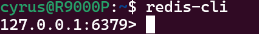

# Getting Started
- [Getting Started](#getting-started)
  - [Overview](#overview)
    - [Functionalities](#functionalities)
    - [Technology stack](#technology-stack)
  - [How to Install and run](#how-to-install-and-run)
    - [Requirements](#requirements)
    - [Installation](#installation)
      - [Import project](#import-project)
      - [Install MySQL](#install-mysql)
      - [Install Redis](#install-redis)
      - [Install RabbitMQ](#install-rabbitmq)
    - [Run](#run)
  - [Pressure Test](#pressure-test)
    - [Test Result](#test-result)
  - [Reference](#reference)
    - [Reference Documentation](#reference-documentation)
    - [Guides](#guides)

## Overview

GitHub: https://github.com/cyrus-xc/Springboot-highThroughput-webApp

This project is a high concurrency online shopping snap up system . It should handle order creation from many users simultaneously and determine which user gets the deal successfully.

A quick example: new iphone15 is released, but Apple only prepare 1,000 units for the first release and there are 5,000 people waiting to buy one on the first day. This system is needed to handle high request flow and create 1,000 orders exactly.

This is a SpringBoot-based high-concurrency system supports thousands and millions simultaneous visits. It is designed in ***SSM***（Spring+SpringMVC+MyBatis）Structure, with implementations of **Controller layer, MyBatis Mapper layer, DAO(Data Access Object) Layer, Service Layer and View Layer**, which is a detailed version of MVC design pattern.


It uses a Redis database to cache high request data and RabbitMQ to desynchronize client request and server response. It also applied common web optimizations like static web pages and cache markers. Here is the full structure of the project:


### Functionalities

**User Interface:**

1. Login page: Login with username and password on webpage. 
2. Item List page: A table view of all items available; Show related info; Button to jump to detail page of selected item.
3. Item Detail page: A table view of item details. A sale start count down clock. A sale status info: "Sale not started; Sale in progress; Sale ended". A button to create order.
4. Order Page: Order status prompt: "Success/Fail/Out of stock", Order detail, and a button to make payment.
5. Order Failed page: Fail to create order with a message.

**Server:**

1. Login Controller: API for user login;  Jump to Item List Page.
2. Good Controller: API for item detail query; Parse sale status for selected item; Parse remain time; 
3. User Controller: API for query user info.
4. Order Controller: API for creating order; Determine if order is legal, and put the create order request to RabbitMQ.
5. User Service: Login session creation; MD5 password encryption; User ticket stored to Redis; Get User object by Cookie.
6. Order Service:  Create Order; Load order to Redis; Get order creation result: "Success/Fail".
7. Goods Service: List items; Get item object by item ID.
8. Goods Mapper: SQL query for goods
9. Order Mapper: SQL query for order
10. User Mapper: SQL query for users
11. POJO (plain old java object) for all data objects; VO (value object) for RespBean objects.
12. RabbitMQ sender(producer) and receiver(consumer).

**Database and MQ:**

1. RabbitMQ: RabbitMQ service on local Linux server
2. Redis: Redis service on local Linux server
3. MySQL: SQL service on local Windows machine

### Technology stack

-  SpringBoot
-  Redis
-  MySQL
-  MyBatis plus
-  RabbitMQ
-  Thymeleaf
-  MD5

## How to Install and run

### Requirements

MySQL 8.0.22 or higher: https://dev.mysql.com/downloads/mysql/  
Redis 6.0.9 or higher: https://redis.io/download  
Redis Insight (optional UI for Redis): https://redislabs.com/redis-enterprise/redis-insight  
JDK 20 or higher: https://www.oracle.com/java/technologies/javase-downloads.html  
JMeter 5.4.1 or higher: https://jmeter.apache.org/download_jmeter.cgi  
RabbitMQ 3.8.19 or higher: https://www.rabbitmq.com/download.html  

### Installation

#### Import project
1. Clone the repository
2. Import the project into your IDE, I am using **Idea Intellij** and **JDK 20** for this project, simply import the project as a Spring project.
Other Java Version should work as well, just change the version in `pom.xml` file.
3. Ensure all dependencies in `pom.xml` are installed and built with Maven.

#### Install MySQL
1. Install MySQL with link provide above.

2. Make sure MySQL is running on your machine, on Windows, you can run `net start mysql` in command line to start MySQL service.

3. Create a database named `springwebapp` in MySQL. Next we need to create 3 tables.

4. Create a table named `t_user` in the database, you can simply run this SQL script:

   ```sql
   CREATE TABLE `t_user` (
   `id` BIGINT ( 20 ) NOT NULL COMMENT 'ID, Phone',
   `nickname` VARCHAR ( 255 ) NOT NULL,
   `password` VARCHAR ( 32 ) DEFAULT NULL COMMENT 'MD5(MD5(password(plain text) + salt) + salt)',
   `salt` VARCHAR ( 10 ) DEFAULT NULL,
   `avater` VARCHAR ( 128 ) DEFAULT NULL COMMENT 'user avater pic url',
   `last_login_date` DATETIME DEFAULT NULL,  
   `login_count` INT ( 11 ) DEFAULT '0',
   PRIMARY KEY ( `id` )
   ```

   copy and run the above.

   May create a testing data with: ``18520655614	Cyrus	b7797cce01b4b131b433b6acf4add449	1a2b3c4d			0``

   

5. Create a table named `t_goods` in the database, run this SQL script:

```sql
  CREATE TABLE `t_goods` ( 
  `id` BIGINT ( 20 ) NOT NULL AUTO_INCREMENT,
  `name` VARCHAR ( 16 ) DEFAULT NULL,
  `title` VARCHAR ( 64 ) DEFAULT NULL,
  `img` VARCHAR ( 128 ) DEFAULT NULL,
  `detail` LONGTEXT DEFAULT NULL,
  `price` DECIMAL ( 10, 2 ) DEFAULT '0.00',
  `stock` INT ( 11 ) DEFAULT '0' COMMENT '-1 means no limit',
  PRIMARY KEY ( `id` ) 
  );
```

  copy and run the above.

  May create a testing data as follows:


6. Create a table named `t_order` in the data base, run this SQL script:

   ```sql
   CREATE TABLE `t_order` ( 
   `id` BIGINT ( 20 ) NOT NULL AUTO_INCREMENT,
   `user_id` BIGINT( 20 ) DEFAULT NULL,
   `goods_id` BIGINT(20) DEFAULT NULL,
   `goods_name` VARCHAR(16) DEFAULT NULL,
   `goods_count` INT(11) DEFAULT '0',
   `goods_price` DECIMAL(10,2) DEFAULT '0.00',
   `status` INT(4) DEFAULT '0' COMMENT 'order status, 0 for new, 1 for paid, 2 for shipped, 3 for delivered, 4 for finished',
   `create_date` DATETIME DEFAULT NULL,
   `pay_date` DATETIME DEFAULT NULL,
   PRIMARY KEY ( `id` ) 
   );
   ```

     copy and run the above.

     May create a testing data as follows:


#### Install Redis

1. You can either install Redis on your machine or use Redis Cloud service.
2. I am using local Redis with WSL on Windows 10, follow this guide to install WSL and setup Ubuntu 20.04: https://docs.microsoft.com/en-us/windows/wsl/install-win10
3. Follow this guide to install Redis on WSL: https://www.digitalocean.com/community/tutorials/how-to-install-and-secure-redis-on-ubuntu-20-04
4. Once Redis is installed, you can run`sudo service redis-server start` then run `redis-cli` to connect to Redis server. 
Take note of the IP address and port number. It is usually `127.0.0.1:6379` if you are running on local machine.


#### Install RabbitMQ
1. Install RabbitMQ on a Linux system is recommended. You can follow this guide to install RabbitMQ on Ubuntu 20.04: https://www.rabbitmq.com/install-debian.html.
2. Once RabbitMQ is installed, you can run `sudo service rabbitmq-server start` to start RabbitMQ service.
3. You can check the status of RabbitMQ service by running `sudo service rabbitmq-server status`. Take note of the IP address and Port number.
4. To access RabbitMQ management console, visit `http://127.0.0.1:15672` to access the management console. The default username and password is `guest`.

### Run
1. Run `SpringwebappApplication.java` in your IDE.
2. Open your browser and visit `http://localhost:8080/login/toLogin`

## Pressure test

To simulate high request flow you want to use JMeter to test the application. You can download JMeter here: https://jmeter.apache.org/download_jmeter.cgi


You can either import the `jmeter.jmx` file in the root directory of this project or create a new test plan.

1. Open JMeter and create a new test plan.
2. Add a Thread Group to the test plan with 10,000 users.
3. Add an HTTP Request to the Thread Group.
4. Add a View Results Tree and Regression Result to the Thread Group.
5. Run the test plan and you should see the result in View Results Tree.

#### Test Result
Before RabbitMQ and Redis are introduced, the average Error% is 48.79 and the throughput is 367.9/s.


After RabbitMQ and Redis are introduced, the average Error% is 15.48 and the throughput is 1568/s.


## Reference

### Reference Documentation

For further reference, please consider the following sections:

* [Official Apache Maven documentation](https://maven.apache.org/guides/index.html)
* [Spring Boot Maven Plugin Reference Guide](https://docs.spring.io/spring-boot/docs/3.0.5/maven-plugin/reference/html/)
* [Create an OCI image](https://docs.spring.io/spring-boot/docs/3.0.5/maven-plugin/reference/html/#build-image)
* [Thymeleaf](https://docs.spring.io/spring-boot/docs/3.0.5/reference/htmlsingle/#web.servlet.spring-mvc.template-engines)
* [Spring Web](https://docs.spring.io/spring-boot/docs/3.0.5/reference/htmlsingle/#web)

### Guides

The following guides illustrate how to use some features concretely:

* [Accessing data with MySQL](https://spring.io/guides/gs/accessing-data-mysql/)
* [Handling Form Submission](https://spring.io/guides/gs/handling-form-submission/)
* [Building a RESTful Web Service](https://spring.io/guides/gs/rest-service/)
* [Serving Web Content with Spring MVC](https://spring.io/guides/gs/serving-web-content/)
* [Building REST services with Spring](https://spring.io/guides/tutorials/rest/)

