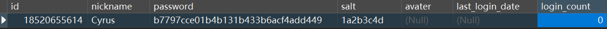
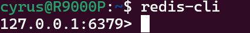

# Getting Started

### Requirements
MySQL 8.0.22 or higher: https://dev.mysql.com/downloads/mysql/ \
Redis 6.0.9 or higher: https://redis.io/download \
Redis Insight (optional UI for Redis): https://redislabs.com/redis-enterprise/redis-insight/ \
JDK 20 or higher: https://www.oracle.com/java/technologies/javase-downloads.html


### Installation
#### Import project
1. Clone the repository
2. Import the project into your IDE, I am using Idea Intellij and JDK 20 for this project, simply import the project as a Spring project.
Other Java Version should work as well, just change the version in `pom.xml` file.
3. Ensure all dependencies in `pom.xml` are installed and built with Maven.

#### Install MySQL
1. Install MySQL with link provide above.

2. Make sure MySQL is running on your machine, on Windows, you can run `net start mysql` in command line to start MySQL service.

3. Create a database named `springwebapp` in MySQL. Next we need to create 3 tables.

4. Create a table named `t_user` in the database, you can simply run this SQL script:

   ```sql
   CREATE TABLE `t_user` (
   `id` BIGINT ( 20 ) NOT NULL COMMENT 'ID, Phone',
   `nickname` VARCHAR ( 255 ) NOT NULL,
   `password` VARCHAR ( 32 ) DEFAULT NULL COMMENT 'MD5(MD5(password(plain text) + salt) + salt)',
   `salt` VARCHAR ( 10 ) DEFAULT NULL,
   `avater` VARCHAR ( 128 ) DEFAULT NULL COMMENT 'user avater pic url',
   `last_login_date` DATETIME DEFAULT NULL,  
   `login_count` INT ( 11 ) DEFAULT '0',
   PRIMARY KEY ( `id` )
   ```

   copy and run the above.

   May create a testing data with: ``18520655614	Cyrus	b7797cce01b4b131b433b6acf4add449	1a2b3c4d			0``
   

5. Create a table named `t_goods` in the database, run this SQL script:

  ```sql
  CREATE TABLE `t_goods` ( 
  `id` BIGINT ( 20 ) NOT NULL AUTO_INCREMENT,
  `name` VARCHAR ( 16 ) DEFAULT NULL,
  `title` VARCHAR ( 64 ) DEFAULT NULL,
  `img` VARCHAR ( 128 ) DEFAULT NULL,
  `detail` LONGTEXT DEFAULT NULL,
  `price` DECIMAL ( 10, 2 ) DEFAULT '0.00',
  `stock` INT ( 11 ) DEFAULT '0' COMMENT '-1 means no limit',
  PRIMARY KEY ( `id` ) 
  );
  ```

  copy and run the above.

  May create a testing data as follows:


6. Create a table named `t_order` in the data base, run this SQL script:

   ```sql
   CREATE TABLE `t_order` ( 
   `id` BIGINT ( 20 ) NOT NULL AUTO_INCREMENT,
   `user_id` BIGINT( 20 ) DEFAULT NULL,
   `goods_id` BIGINT(20) DEFAULT NULL,
   `goods_name` VARCHAR(16) DEFAULT NULL,
   `goods_count` INT(11) DEFAULT '0',
   `goods_price` DECIMAL(10,2) DEFAULT '0.00',
   `status` INT(4) DEFAULT '0' COMMENT 'order status, 0 for new, 1 for paid, 2 for shipped, 3 for delivered, 4 for finished',
   `create_date` DATETIME DEFAULT NULL,
   `pay_date` DATETIME DEFAULT NULL,
   PRIMARY KEY ( `id` ) 
   );
   ```

     copy and run the above.

     May create a testing data as follows:


#### Install Redis

1. You can either install Redis on your machine or use Redis Cloud service.
2. I am using local Redis with WSL on Windows 10, follow this guide to install WSL and setup Ubuntu 20.04: https://docs.microsoft.com/en-us/windows/wsl/install-win10
3. Follow this guide to install Redis on WSL: https://www.digitalocean.com/community/tutorials/how-to-install-and-secure-redis-on-ubuntu-20-04
4. Once Redis is installed, you can run`sudo service redis-server start` then run `redis-cli` to connect to Redis server. 
Take note of the IP address and port number. It is usually `127.0.0.1:6379` if you are running on local machine.


### Run
1. Run `SpringwebappApplication.java` in your IDE.
2. Open your browser and visit `http://localhost:8080/login/toLogin`

### Reference Documentation

For further reference, please consider the following sections:

* [Official Apache Maven documentation](https://maven.apache.org/guides/index.html)
* [Spring Boot Maven Plugin Reference Guide](https://docs.spring.io/spring-boot/docs/3.0.5/maven-plugin/reference/html/)
* [Create an OCI image](https://docs.spring.io/spring-boot/docs/3.0.5/maven-plugin/reference/html/#build-image)
* [Thymeleaf](https://docs.spring.io/spring-boot/docs/3.0.5/reference/htmlsingle/#web.servlet.spring-mvc.template-engines)
* [Spring Web](https://docs.spring.io/spring-boot/docs/3.0.5/reference/htmlsingle/#web)

### Guides

The following guides illustrate how to use some features concretely:

* [Accessing data with MySQL](https://spring.io/guides/gs/accessing-data-mysql/)
* [Handling Form Submission](https://spring.io/guides/gs/handling-form-submission/)
* [Building a RESTful Web Service](https://spring.io/guides/gs/rest-service/)
* [Serving Web Content with Spring MVC](https://spring.io/guides/gs/serving-web-content/)
* [Building REST services with Spring](https://spring.io/guides/tutorials/rest/)

